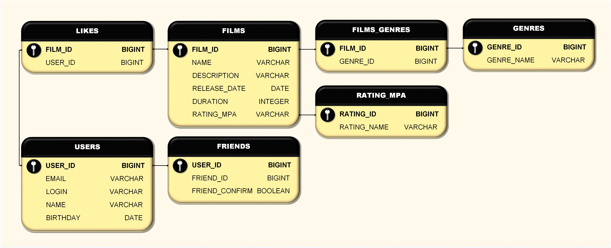

# **Filmorate**
### Описание проекта
Разработка бэкенд части для сервиса оценки фильмов пользователями и формирования рейтинга фильмов на их основе.
### Стек используемых технологий 
Java 11, REST Spring Boot, Maven, Lombock, SLF4J

### Схема базы данных




<details>

<summary>Примеры SQL-запросов для основных операций приложения.</summary>

Получение списка всех фильмов

```
SELECT *
FROM FILMS;
```
Получение списка всех пользователей


```
SELECT *
FROM USERS;
```
Получение списка 5 самых популярных фильмов
```
SELECT F.NAME AS TITLE,
COUNT(L.USER_ID) AS LIKES_VALUE
FROM FILMS AS F
LEFT JOIN LIKES AS L ON F.FILM_ID = L.USER_ID
GROUP BY TITLE
ORDER BY LIKES_VALUE DESC
LIMIT 5;
```

</details>

