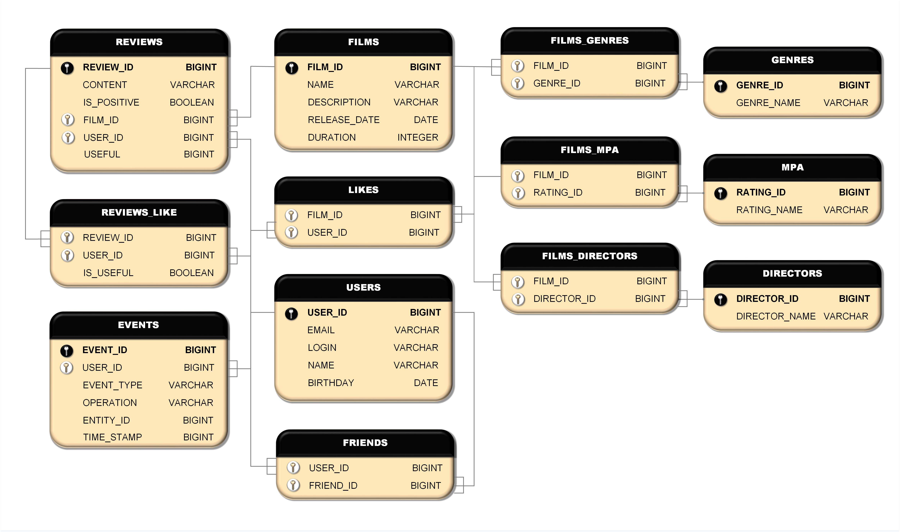

# **Filmorate**

### Описание проекта

Разработка бэкенд части для сервиса оценки фильмов пользователями и формирования рейтинга фильмов на их основе.

### Стек используемых технологий 

Java 11, REST Spring Boot, Maven, Lombock, SLF4J, JUnit, AssertJ, H2 database

Задачи:

ALG_1. Функциональность «Отзывы». - [Владимир](https://github.com/v-s-ganeev)
ALG_2. Функциональность «Поиск». - Евгений
ALG_3. Функциональность «Общие фильмы». - Евгений
ALG_4. Функциональность «Рекомендации». - [Алексей](https://github.com/AlexeiEgorov)
ALG_5. Функциональность «Лента событий». - Контроллер - [Игорь](https://github.com/IgorVasilievV)
                                         - База данных - [Павел](https://github.com/NazarovPV)
ALG_6. Удаление фильмов и пользователей. - [Павел](https://github.com/NazarovPV)
ALG_7. Добавление режиссёров в фильмы. - Евгений
ALG_8. Вывод самых популярных фильмов по жанру и годам. - [Игорь](https://github.com/IgorVasilievV)
ALG_9. *** Рефакторинг: лайки → оценки.


### Схема базы данных




<details>

<summary>Примеры SQL-запросов для основных операций приложения.</summary>


Получение списка всех фильмов
```sql
SELECT *
FROM FILMS;
```
Получение списка всех пользователей
```sql
SELECT *
FROM USERS;
```
Получение списка 5 самых популярных фильмов
```sql
SELECT F.NAME AS TITLE,
COUNT(L.USER_ID) AS LIKES_VALUE
FROM FILMS AS F
LEFT JOIN LIKES AS L ON F.FILM_ID = L.FILM_ID
GROUP BY TITLE
ORDER BY LIKES_VALUE DESC
LIMIT 5;
```

Получение списка общих друзей с другим пользователем
```sql
SELECT U.NAME AS USER,
U2.NAME AS FRIEND
FROM USERS AS U
LEFT JOIN FRIENDS AS F ON U.USER_ID = F.USER_ID
LEFT JOIN USERS AS U2 ON F.FRIEND_ID = U2.USER_ID
WHERE U.USER_ID = 2 AND FRIEND_CONFIRM = true
ORDER BY FRIEND;
```

http://sqlfiddle.com/#!9/9d4e63/27
</details>

